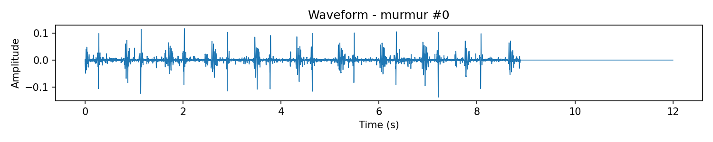

# Heartbeat Sounds - PyTorch Pipeline

End‑to‑end, reproducible heart sound (phonocardiogram) classification pipeline in PyTorch. The project modularizes data loading, feature engineering, model architectures, training, experiment tracking, and visualization so you can iterate on improving clinically important murmur detection performance.

Original exploratory inspiration / reference notebook: https://www.kaggle.com/code/mychen76/heart-sounds-analysis-and-classification-with-lstm (this repo restructures and extends it for experimentation).

---
## 1. Dataset Overview

Data path: `data/` (kept out of git). Two provided source folders (e.g. `set_a/`, `set_b/`). Each WAV filename encodes a coarse label prefix. We currently map three classes via `CATEGORY_MAP` in `src/data/dataset.py`:

| Label Prefix | Class Index | Description (Simplified) |
|--------------|-------------|---------------------------|
| `artifact`   | 0           | Noisy / unusable recording (motion, ambient artefacts). |
| `murmur`     | 1           | Pathological heart sound containing a murmur. |
| `normal`     | 2           | Normal phonocardiogram (S1/S2 only). |

Total loaded samples: 520 clips (Set A: 105, Set B: 415). Class imbalance is typical: murmurs are notably fewer than normal or artifact recordings

Audio is resampled to 16 kHz (`sr=16000`) and (optionally) trimmed / padded to a fixed `max_duration` (default 12 s) for consistent feature tensor shapes.

### Sample Class Examples
Waveforms (top) and Mel Spectrograms (bottom) for one example per class:

| Artifact | Murmur | Normal |
|----------|--------|--------|
|  |  |  |
|  |  |  |

These illustrate typical differences: murmur exhibits more sustained broadband energy (spectrogram filling) versus the more discrete S1/S2 components in normal recordings; artifact often shows irregular high‑variance bursts.

---
## 2. Classification Task

Goal: Multi‑class classification (artifact vs murmur vs normal) with particular interest in **improving murmur recall** (sensitivity) while maintaining balanced performance on other classes.

Key evaluation artifacts per experiment:
* `classification_report.txt` / `.json` – precision/recall/F1 per class.
* `confusion_matrix.png` – raw + normalized confusion matrices.
* `recall_progress.png` – evolution of per‑class recall across experiments.
* `recall_gains.png` – incremental recall improvement vs the baseline experiment.

Why focus on recall for murmurs? False negatives (missed murmurs) are clinically riskier than some false positives; prioritizing recall early guides feature/model choices.

---
## 3. Feature Engineering Strategy

Two complementary feature pipelines:

1. **Baseline (Collapsed) MFCC** (`feature_type=mfcc`)
   - Extract `n_mfcc` coefficients and mean‑pool over time → a fixed vector (fast but discards temporal morphology of S1/S2/murmur spans).

2. **Temporal Sequence Features** (`feature_type=sequence` – default)
   - Log‑Mel spectrogram (`n_mels`)
   - MFCCs derived from the same log‑Mel energy
   - Optional delta + delta‑delta (temporal derivatives)
   - Optional spectral statistics per frame: centroid, bandwidth, rolloff, contrast, zero‑crossing rate, RMS energy
   - Concatenate along feature axis → matrix `(T, F)` with padding to the batch max length.

Why this matters: Murmurs are often spread across systolic or diastolic windows and exhibit sustained broadband energy or characteristic frequency bands—temporal retention + richer descriptors improves separability compared to mean pooling.

### 3.1 MFCC (Collapsed) – What Happens Internally
Pipeline (per windowed frame):
1. Pre‑emphasis + framing + window (Hann) (handled internally by `librosa.feature.mfcc`).
2. Short‑Time Fourier Transform (STFT) magnitude → power spectrum.
3. Mel filterbank integration (triangular filters spaced on perceptual Mel scale).
4. Log compression (log power stabilizes variance, approximates loudness perception).
5. Discrete Cosine Transform (DCT-II) decorrelates log‑Mel energies → MFCC coefficients (low indices capture spectral envelope; higher indices ≈ fine detail/noise).
6. (Our baseline) Mean pooling over all time frames → discards timing of S1/S2 intervals & murmur duration patterns.

Trade‑offs:
* Pros: Very compact, fast, fewer parameters required downstream, reduced overfitting risk on tiny datasets.
* Cons: Loses temporal morphology vital for distinguishing sustained vs transient energy (murmur vs normal heart cycle), sensitive to class imbalance because minority murmur nuances are averaged out.

### 3.2 Temporal Sequence Feature Stack – Detailed Components
For each audio we build a time × feature matrix before padding:
* Log‑Mel Spectrogram: Stable energy representation; retains broad spectral shape of murmurs (often mid‑frequency turbulence).
* MFCCs (from same log‑Mel): Provide smoothed spectral envelope; complementary to raw log‑Mel bins (which retain finer localized energy peaks).
* Delta (Δ) & Delta‑Delta (Δ²): First and second temporal derivatives highlight changes/acceleration in spectral envelope—murmur turbulence yields different derivative statistics than clean S1/S2 peaks.
* Spectral Centroid: Energy “center of mass” (murmurs can shift centroid upwards relative to pure heart sounds dominated by lower frequency components).
* Bandwidth: Spread of the spectrum—turbulent flow broadens bandwidth.
* Rolloff (e.g., 85/95% energy frequency): Higher rolloff can indicate extended high‑frequency content typical in some murmurs.
* Spectral Contrast: Difference between peaks and valleys in sub‑bands; murmurs can flatten contrast due to broadband noise.
* Zero Crossing Rate (ZCR): Proxy for high‑frequency / noisiness content (useful but noisy, complementary signal).
* RMS Energy: Frame‑level loudness; murmurs sometimes elevate inter‑S1/S2 baseline energy.

All features are frame‑aligned then concatenated along the feature axis (row‑wise before transpose). Padding to the longest sequence in a batch retains comparability while enabling efficient batching.

### 3.3 Rationale for Each Enhancement
| Enhancement | Signal Property Captured | Murmur Benefit |
|-------------|--------------------------|----------------|
| Log‑Mel     | Broad spectral energy    | Sustained broadband turbulence visibility |
| MFCC        | Smoothed envelope        | Differentiates envelope distortion vs normal cyclical form |
| Δ / Δ²      | Temporal dynamics        | Highlights continuous vs discrete transient patterns |
| Centroid/Bandwidth/Rolloff | Spectral distribution shape | Detects higher frequency spread |
| Contrast    | Peak–valley sharpness    | Murmurs may reduce contrast (more filled in spectrum) |
| ZCR         | High‑frequency activity  | Increased zero crossings from noisy turbulence |
| RMS         | Amplitude modulation     | Elevated baseline between S1/S2 |

### 3.4 Padding & Masking Considerations
We zero‑pad sequences to `max_T` per mini‑batch. For large architectural changes (e.g., Transformers), an explicit attention mask would be added so padded frames don’t dilute pooling/attention. Current attention pooling implicitly learns to down‑weight near‑zero padded frames (still acceptable at current scale). Future improvement: supply a mask derived from original frame counts.

### 3.5 Possible Future Feature Extensions
* Cycle segmentation (PCG envelope → identify S1/S2 boundaries → segment systolic/diastolic windows, compute targeted statistics).
* Continuous Wavelet Transform (CWT) scalograms for better time‑frequency resolution at lower frequencies.
* Constant‑Q Transform (CQT) to focus on logarithmic frequency scaling (closer to perceived pitch changes).
* Learned representations (wav2vec2 / YAMNet embeddings concatenated with handcrafted statistics).
* Adaptive SpecAugment: on‑the‑fly time/frequency masking for regularization.

### 3.6 Why Not Just Raw Waveform End‑to‑End?
Raw 1D CNNs or large audio transformers need more data to generalize; handcrafted + low/medium capacity models converge faster and allow clearer ablation of what helps murmur recall. This staged approach establishes a strong classical baseline before heavier end‑to‑end models.

---
## 4. Model Architectures

| Model | When Used | Core Idea |
|-------|-----------|-----------|
| `HeartSoundLSTM` | `feature_type=mfcc` | Treat MFCC coefficients as a short pseudo‑sequence, simple LSTM + MLP head. |
| `SequenceCRNN` | `feature_type=sequence` | Conv1d blocks on feature channels → BiLSTM → attention pooling → dense classifier. |

`SequenceCRNN` uses an attention mechanism to weight informative frames (e.g., murmur segments) rather than uniformly average across time.

### 4.1 HeartSoundLSTM (Baseline)
Input: Mean‑pooled MFCC vector (size `n_mfcc`). We reshape to (pseudo) sequence `(T=n_mfcc, 1)` so an LSTM passes over coefficient index order. While coefficient order isn’t temporal, the LSTM acts like a small adaptive mixing layer. Limitation: cannot model acoustic temporal evolution—only inter‑coefficient relationships.

### 4.2 SequenceCRNN Architecture Breakdown
1. Linear Projection (optional): Align feature dimensionality or reduce redundancy.
2. Temporal Conv1d Stack: Treat feature dimension as channels → local temporal receptive fields capture short murmurous fluctuations & envelope transitions.
3. BiLSTM: Models longer‑range bidirectional dependencies (context across entire cardiac cycle) – useful for distinguishing systolic vs diastolic murmur placement.
4. Attention Pooling: Learns scalar score per time frame `e_t = v^T tanh(W h_t)`, softmax normalized; pooled representation `Σ α_t h_t`. Frames with turbulent spectral signatures get higher weight; padding frames have near‑zero activations.
5. Classifier MLP: Non‑linear projection + dropout for regularization.

### 4.3 Why Conv Before LSTM?
Convolutions provide local smoothing + hierarchical abstraction, reducing LSTM burden (fewer timesteps with salient features) and offering inductive bias for local stationarity, improving sample efficiency.

### 4.4 Why Bidirectionality?
Murmur characterization may depend on relative energy patterns before and after a frame (e.g., crescendo–decrescendo). BiLSTM captures both past and future context simultaneously, improving discriminative framing without needing explicit cycle segmentation yet.

### 4.5 Attention vs Global Average Pooling
Global average would dilute short murmur intervals. Attention assigns higher weights to frames with high diagnostic value, effectively performing soft frame selection. This reduces sensitivity to extraneous quiet or padded regions.

### 4.8 Why Not Direct Transformer Yet?
Transformers excel with ample data or strong augmentations; on modest sample counts they overfit quickly. CRNN + attention is a pragmatic middle ground with fewer parameters and stronger inductive bias for local stationarity.

---
## 5. Imbalance Handling & Losses

* **Class weighting**: Inverse frequency weights automatically inferred from training split (enabled by default).
* **Focal loss (optional)**: `--focal --gamma 2.0` to focus gradient on hard / minority examples (experimental; off by default).

### Predefined Experiment Suite
Run a standardized progression to quantify incremental gains (baseline → temporal → +class weighting → +deltas & spectral stats):
```bash
python -m src.utils.cli train --suite --epochs 20
```
This executes four experiments:
1. `1_mfcc_baseline` (collapsed MFCC, no weighting, no extras)
2. `2_seq_base` (sequence features, no weighting, minimal descriptors)
3. `3_seq_cw` (sequence + class weighting)
4. `4_seq_cw_deltas_stats` (sequence + weighting + deltas + spectral stats)

Compare `recall_progress.png` and `recall_gains.png` to visualize where each enhancement helps (especially murmur recall).

Current recall progression (latest runs):


Incremental gains vs baseline:


---


---

## Project Layout

```
├── data/                # (ignored by git - raw data)
├── src/
│   ├── data/dataset.py  # Loading & assembling dataset
│   ├── features/mfcc.py # MFCC feature extraction helpers
│   ├── models/lstm.py   # PyTorch LSTM model
│   ├── training/train.py# Training script & loops
│   ├── utils/cli.py     # CLI entrypoint (train / visualize)
│   └── utils/visualize.py # Visualization helpers
├── models/              # Saved model weights (*.pt)
├── results/             # Reports & metrics + visualizations
├── requirements.txt
└── README.md
```

## Install

```bash
pip install -r requirements.txt
```

## Run Training (Single Experiment)

```bash
python -m src.utils.cli train --data_dir data --epochs 25 --batch_size 32 --feature_type sequence
```

Key per‑experiment artifacts now live under `results/<EXPERIMENT_LABEL>/` and model weights under `models/<EXPERIMENT_LABEL>/`.

Baseline suite (progressive feature & imbalance improvements):
```bash
python -m src.utils.cli train --suite --epochs 20
```

## Visualize Sample Waveforms & Spectrograms
Export a few examples per class (default 2) including waveform PNG, mel spectrogram PNG, and audio copy.

```bash
python -m src.utils.cli visualize --data_dir data --per_class 3 --results_dir results
```
Disable writing audio snippets:
```bash
python -m src.utils.cli visualize --no_audio
```
Outputs go to:
```
results/visualizations/
  waveforms/*.png
  spectrograms/*.png
  audio/*.wav
```
